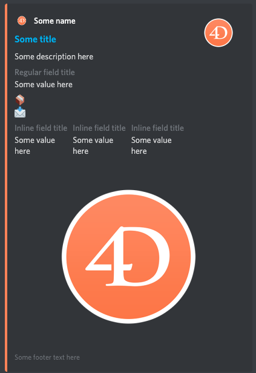

<!-- Type here your summary -->
# MessageEmbed

## Description

> If you have been around on Discord for a bit chances are you have seen these special messages. They have a colored border, are often sent by bots and have embedded images, text fields and other fancy stuff. [@Discord](https://discordjs.guide/popular-topics/embeds.html)

## Create a message

### Embed preview

Here is an example of what an embed may look like. We will go over their construction in the next part of this guide.


### Using builder functions

Class `MessageEmbed` contains builder functions that you can chain for easy construction and manipulation of embed.

```4d
$exampleEmbed:=Discord .MessageEmbed.new()
$imageUrl:="https://fr.4d.com/sites/default/files/unknown_1.png"
$exampleEmbed.setColor(16483663)\
.setTitle("Some title")\
.setURL("https://4d.com/")\
.setAuthor(New object("name";"Some name";"icon_url";$imageUrl;"url";"https://4d.com/"))\
.setDescription("Some description here")\
.setThumbnail($imageUrl)\
.addFields(New collection(\
New object("name";"Regular field title";"value";"Some value here");\
New object("name";"📦";"value";"📩");\
New object("name";"Inline field title";"value";"Some value here";"inline";True);\
New object("name";"Inline field title";"value";"Some value here";"inline";True)\
))\
.addField(New object("name";"Inline field title";"value";"Some value here";"inline";True))\
.setImage($imageUrl)\
.setFooter(New object("text";"Some footer text here";"url";"https://fr.4d.com/sites/default/files/unknown_1.png"))
```

> TIPS: You don't need to include all the elements showcased above. If you want a simpler embed, just leave some out.
