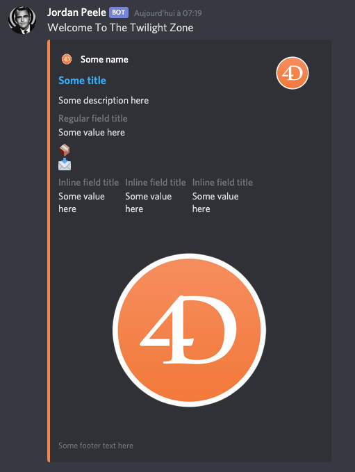

# Discord.4d
 
[](https://developer.4d.com/)
[](https://developer.4d.com/)

[](https://github.com/mesopelagique/Discord.4d/releases/latest)
[](LICENSE)
[![discord][discord-shield]][discord-url]

Send messages to discord using 4D.

Here is an example of what you can achieve.



## How?

First create a [web hook client](Documentation/Classes/WebhookClient.md)

```4d
$hook:=Discord .WebhookClient.new("https://discordapp.com/api/webhooks/<id>/<token>")
```

Then send a message using the hook.

```4d
  // send a simple message
$result:=$hook.send("Welcome To The Twilight Zone")
```

If you want more fancy stuff use an [embed message](Documentation/Classes/MessageEmbed.md).

```4d
$exampleEmbed:=Discord .MessageEmbed.new()
$imageUrl:="https://fr.4d.com/sites/default/files/unknown_1.png"
$exampleEmbed.setColor(16483663)\
.setTitle("Some title")\
.setURL("https://4d.com/")\
.setAuthor(New object("name";"Some name";"icon_url";$imageUrl;"url";"https://4d.com/"))\
.setDescription("Some description here")\
.setThumbnail($imageUrl)\
.addFields(New collection(\
New object("name";"Regular field title";"value";"Some value here");\
New object("name";"📦";"value";"📩");\
New object("name";"Inline field title";"value";"Some value here";"inline";True);\
New object("name";"Inline field title";"value";"Some value here";"inline";True)\
))\
.addField(New object("name";"Inline field title";"value";"Some value here";"inline";True))\
.setImage($imageUrl)\
.setFooter(New object("text";"Some footer text here";"url";"https://fr.4d.com/sites/default/files/unknown_1.png"))

$result:=$hook.send($exampleEmbed)
```

> TIPS: You don't need to include all the elements showcased above. If you want a simpler embed, just leave some out.

---

[](https://mesopelagique.github.io/)

[discord-shield]: https://img.shields.io/badge/chat-discord-7289DA?logo=discord&style=flat
[discord-url]: https://discord.gg/dVTqZHr
